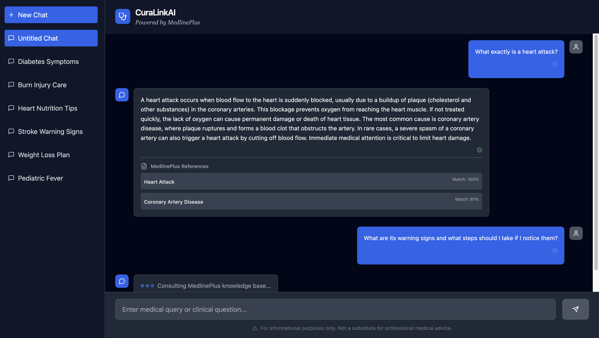

# MedlinePlus Chatbot – AI-Powered Clinical Knowledge Assistant

AI-driven clinical chatbot that references trusted medical content from MedlinePlus through a custom Retrieval-Augmented Generation pipeline backed by a high-performance vector database to deliver concise, evidence-backed medical answers in real time.

## Overview

* **React + TailwindCSS** - Modern, responsive web interface built with Vite for speed
* **FastAPI Backend** - API layer
* **Custom RAG Pipeline** – Parses and indexes MedlinePlus XML into a local FAISS vector database
* **FAISS + SentenceTransformers** – L2 Semantic search with cached embeddings for sub-second retrieval
* **Evidence-Backed Responses** - Every answer cites ranked MedlinePlus sources with relevance scores
* **LLM Integration** – Works seamlessly with OpenAI, DeepSeek, Groq, or any compatible API
* **Local Knowledge Base** - Operates independently without external databases after setup

## Data Source: MedlinePlus

This chatbot leverages [MedlinePlus](https://medlineplus.gov/) — a health information service of the U.S. National Library of Medicine (NLM), part of the National Institutes of Health (NIH).
MedlinePlus provides high-quality, reliable, and up-to-date information on diseases, conditions, medications, and wellness topics.
All content is evidence-based, written in plain language, and reviewed by medical experts.

For more details, visit [medlineplus.gov](https://medlineplus.gov/).

## Project Structure

```
/frontend        # React-based UI (Vite + TailwindCSS)
/server          # FastAPI backend (RAG + LLM orchestration)
/server/mplus_*.xml  # MedlinePlus XML medical dataset
```

## Backend Setup

1. Navigate to backend:
   ```bash
   cd server
   ```

2. (Optional) Create a virtual environment:
   ```bash
   python -m venv venv
   source venv/bin/activate  # Windows: venv\Scripts\activate
   ```

3. Install dependencies:
   ```bash
   pip install -r requirements.txt
   ```

4. Set your API key securely:
   Create a `.env` file in `/server`:
   ```ini
   OPENAI_API_KEY=your-api-key
   ```

5. Add an updated MedlinePlus XML dataset (optional):
   Place `.xml` file (e.g. `mplus_topics_2025-07-19.xml`) in `/server`.

6. Start the backend:
   ```bash
   uvicorn main:app --reload
   ```

**First run** will:
* Parse MedlinePlus XML topics
* Generate embeddings
* Build a FAISS index
* Cache as `faiss_index.bin` and `documents.json`

Backend runs at: `http://127.0.0.1:8000`

## Frontend Setup

1. Navigate to frontend:
   ```bash
   cd frontend
   ```

2. Install dependencies:
   ```bash
   npm install
   ```

3. Start development server:
   ```bash
   npm run dev
   ```

Frontend runs at: `http://localhost:5173`

## Usage

1. Open the app in your browser.
2. Ask a clinical question, e.g.:
   *"What are the symptoms of pneumonia?"*
3. CuraLinkAI will:
   * Retrieve relevant content from the FAISS index
   * Pass it to the LLM for synthesis
   * Return a clear, concise answer with cited sources



(If the image appears blurry in this preview, please click on it to view in full resolution)

## Future Enhancements

* Customized RAG implementation from scratch
* Add more sources
* Offline functionality
* Advanced filtering by specialty or evidence level
* Dockerized setup for streamlined deployment and reproducibility

## Why RAG Matters

Retrieval-Augmented Generation (RAG) combines the strengths of information retrieval and large language models to deliver accurate, trustworthy, and explainable answers.

Instead of relying solely on the LLM's internal knowledge — which can be outdated or hallucinated — RAG fetches up-to-date, domain-specific information from a trusted source (in this case, MedlinePlus) before generating a response.

This approach ensures:
- **Accuracy** – Answers are grounded in verified medical resources
- **Explainability** – Responses include citations to original sources
- **Adaptability** – Knowledge base can be updated without retraining the model
- **Reduced Hallucination** – Minimizes fabricated or misleading medical advice

## Disclaimer

This project is for experimental and research purposes only. It is not a substitute for professional medical advice.
